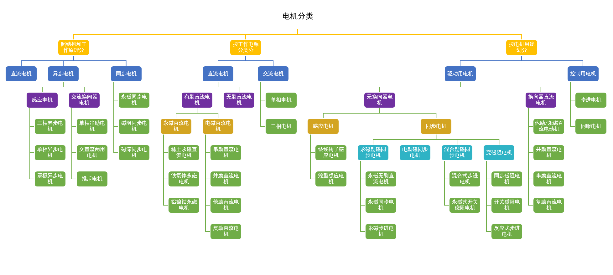

# 电机分类



## 1，按照结构和工作原理划分

```
直流电机
异步电机
    感应电机
        三相异步电机
        单相异步电机
        罩极异步电机
    交流换向器电机
        单相串励电机
        交直流两用电机
        推斥电机
同步电机
    永磁同步电机(PMSM)
    磁阻同步电机
    磁滞同步电机
```

## 2，按工作电源分类分

```
直流电机
    有刷直流电机
        永磁直流电机
            稀土永磁直流电机
            铁氧体永磁电机
            铝镍钴永磁电机
        电磁直流电机
            串励直流电机
            并励直流电机
            他励直流电机
            复励直流电机
    无刷直流电机(BLDC)
交流电机
    单相电机
    三相电机
```

## 3，按电机用途划分

```
驱动用电机
    无换向器电机
        感应电机
            绕线转子感应电机
            笼型感应电机
        同步电机
            永磁励磁同步电机
                永磁无刷直流电机
                永磁同步电机
                永磁步进电机
            电励磁同步电机
            混合励磁同步电机
                混合式步进电机
                永磁式开关磁阻电机
            变磁阻电机
                同步磁阻电机
                开关磁阻电机
                反应式步进电机
    换向器直流电机
        他励/永磁直流电动机
        并励直流电机
        串励直流电机
        复励直流电机
控制用电机
    步进电机
    伺服电机
```

## 4，常见电机

```
直流电机，异步电机，感应电机，三相异步电机，单相异步电机，罩极异步电机，
交流换向器电机，单相串励电机，交直流两用电机，推斥电机，同步电机，
永磁同步电机(PMSM)，磁阻同步电机，磁滞同步电机，直流电机，有刷直流电机，
永磁直流电机，稀土永磁直流电机，铁氧体永磁电机，铝镍钴永磁电机，
电磁直流电机，串励直流电机，并励直流电机，他励直流电机，复励直流电机，
无刷直流电机(BLDC)，交流电机，单相电机，三相电机，驱动用电机，
无换向器电机，感应电机，绕线转子感应电机，笼型感应电机，同步电机，
永磁励磁同步电机，永磁无刷直流电机，永磁同步电机，永磁步进电机，
电励磁同步电机，混合励磁同步电机，混合式步进电机，永磁式开关磁阻电机，
变磁阻电机，同步磁阻电机，开关磁阻电机，反应式步进电机，换向器直流电机，
他励/永磁直流电动机，并励直流电机，串励直流电机，复励直流电机，
控制用电机，步进电机，伺服电机
```

参考文献

